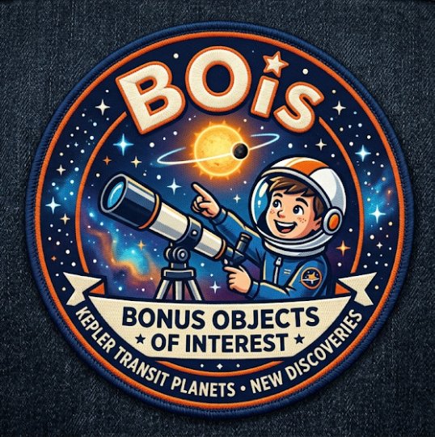
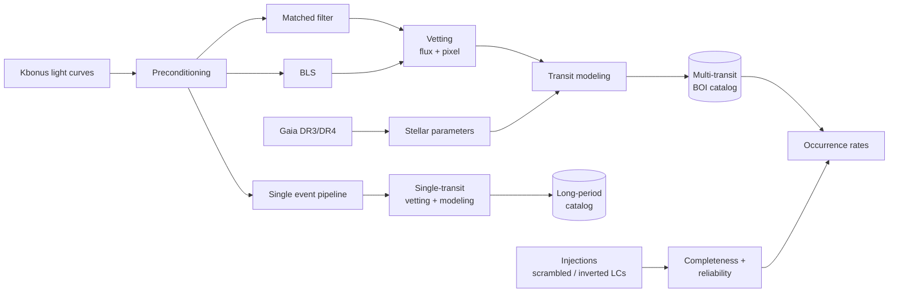

  

# Here Come the BOIs 🔭

**Comprehensive exoplanet demographics with the Kepler-Bonus light curves**

Kepler's long baseline and photometric precision are still unmatched. Using Gaia source positions and PSF photometry, the [Kepler-Bonus (Kbonus)](https://archive.stsci.edu/hlsp/kbonus-bkg) project ([Martínez-Palomera et al. 2023](https://doi.org/10.3847/1538-3881/ad0727)) extracted **606,900 light curves** from archival Kepler data. That includes **406,548 background stars that have never been searched for planets**.

This organization hosts the software and data products of a NASA Exoplanets Research Program (XRP) investigation to:

1. **Find new Bonus Objects of Interest (BOIs).** We uniformly search and vet every Kbonus light curve for transiting planets, including long-period planets with only one or two transits.
2. **Measure planet occurrence rates.** The background stars were not hand-selected, so they give an unbiased sample, and the number of M dwarfs grows from about 3,700 to about 27,500.

Our proof of concept, **BOI-1.01**, is a sub-Neptune candidate. Its G = 17.8 host is fainter than any known KOI and lies less than 3 pixels from a saturated Kepler target.

## Planned products

| | Product | Section |
|---|---|---|
| ⭐ | Uniform stellar parameters for all ~600,000 Kbonus stars (Gaia DR3/DR4, SPOTS models) | §1.2.1 |
| 🧹 | Light curve preconditioning pipeline | §1.2.2.1 |
| 🪐 | Unified multi-transit BOI catalog (matched-filter + BLS search, uniform vetting) | §1.2.2.2–6 |
| 🌗 | Long-period catalog of mono- and duo-transit candidates (single event pipeline) | §1.2.2.3 |
| 📈 | Completeness and reliability models in DR25-style formats | §1.2.3 |
| 📝 | Occurrence rate papers for FGK and M dwarf hosts, including habitable-zone rocky planets around early M dwarfs | §1.2.3.4 |

## How the pieces fit

## Open science

* All software is MIT licensed, developed in the open on GitHub, and released on PyPI where it makes sense.
* The exact software version behind each paper is archived on **Zenodo** with a DOI.
* Catalogs are released as **Parquet** and as journal machine-readable tables. Period posteriors and other supplementary products are released as CSV on Zenodo.
* Papers will be published open access.

## Timeline

| Milestone | Target |
|---|---|
| Program start | Sep 2027 |
| Stellar catalog | Feb 2028 |
| Multi-event planet catalog | Apr 2029 |
| Single event planet catalog | Aug 2029 |
| Occurrence rate publications | Jul 2030 |

---

Supported by the NASA ROSES Exoplanets Research Program (XRP). Kepler data are from the Mikulski Archive for Space Telescopes (MAST).
